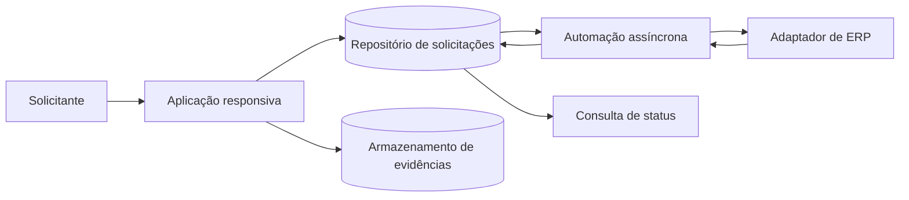

# Workflow de Solicitações Financeiras

Case público de **arquitetura documentada** para uma jornada de solicitações financeiras, com validação de rateio, anexos, acompanhamento de status e integração assíncrona com um ERP.

> Este repositório é uma reconstrução segura para portfólio. Os dados, identificadores, nomes de campos e fluxos foram recriados para fins demonstrativos. Não contém aplicativo original, exportações de solução, fluxos, credenciais, ambientes, documentos anexados ou dados corporativos.

## Problema abordado

Equipes de negócio precisam registrar solicitações financeiras sem depender do acesso direto ao ERP. O fluxo deve coletar dados consistentes, validar o valor distribuído entre centros de custo, permitir anexar evidências e tornar o processamento rastreável.

## O que este case demonstra

- Modelagem de uma solicitação financeira com cabeçalho, rateios e evidências.
- Separação entre o registro da solicitação e o processamento assíncrono no ERP.
- Estados explícitos para rascunho, envio, processamento, decisão e liquidação.
- Contrato JSON e exemplo sintético validável.
- Critérios de aceite e cenários de teste para regras críticas.

## Arquitetura pública



Consulte a [arquitetura detalhada](docs/architecture.md), o [contrato de dados](models/financial_request.schema.json), o [exemplo sintético](samples/financial_request.sample.json) e os [cenários de teste](docs/test_scenarios.md).

## Limites e status

- **Status:** Arquitetura documentada.
- **Evidência publicada:** documentação, diagrama, schema JSON, dados sintéticos e checklist de revisão.
- **Não alegado:** uso em produção, métricas de negócio, integração ativa ou acesso a ambiente de terceiros.

## Validação local

O exemplo pode ser validado com Python e `jsonschema`:

```powershell
python -m pip install jsonschema
python -c "import json; from jsonschema import validate; validate(json.load(open('samples/financial_request.sample.json', encoding='utf-8')), json.load(open('models/financial_request.schema.json', encoding='utf-8'))); print('sample valid')"
```

O schema verifica o formato estrutural. A regra de que a soma dos rateios deve ser igual ao valor total é uma regra semântica e está coberta nos cenários de teste.

## Tecnologias e práticas representadas

`Power Apps Canvas` · `Power Automate` · `SharePoint ou Dataverse` · `Integração de ERP` · `Modelagem de dados` · `Validação de regras` · `Testes`

## Segurança do material público

Leia [public_safety.md](docs/public_safety.md) antes de reaproveitar este case. Toda publicação derivada deve preservar o caráter sintético do material.
