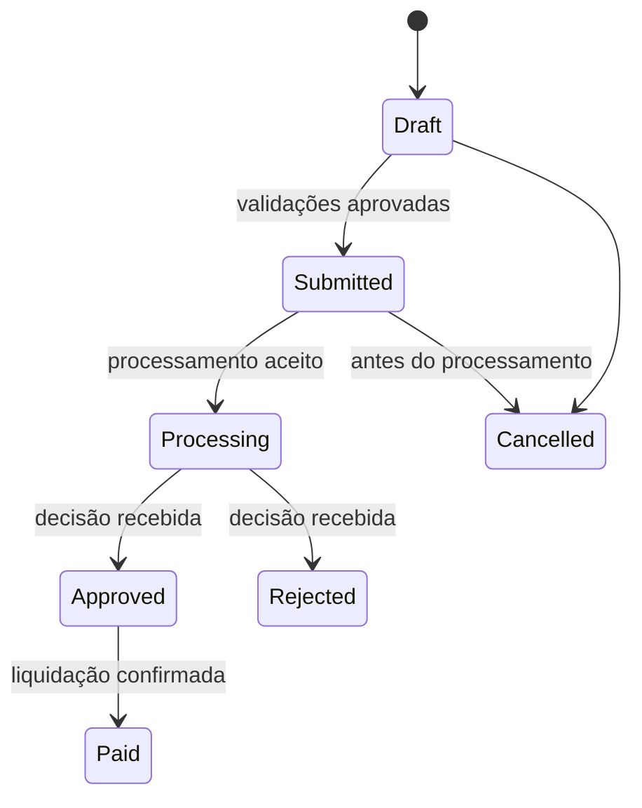

# Arquitetura de referência

## Objetivo

Permitir que uma pessoa registre uma solicitação financeira, acompanhe sua situação e anexe evidências, sem acoplamento direto entre a interface e o ERP.

## Componentes

| Componente | Responsabilidade | Limite público |
| --- | --- | --- |
| Aplicação responsiva | Coletar, validar e salvar rascunhos ou solicitações enviadas | Referência de arquitetura; não inclui pacote de aplicativo |
| Repositório de solicitações | Persistir cabeçalho, rateios, estado e trilha de status | Modelo lógico, sem URL, lista ou tabela real |
| Armazenamento de evidências | Associar metadados de anexos à solicitação | Não contém arquivos, nomes reais ou links |
| Automação assíncrona | Entregar solicitações prontas ao adaptador e registrar retornos | Fluxo descrito, sem exportação ou conexão |
| Adaptador de ERP | Traduzir contrato público para o sistema externo | Interface ilustrativa; nenhum sistema real é identificado |

## Fluxo de estados

Uma transição deve ser idempotente: o reenvio do mesmo identificador de solicitação não pode criar duplicidade no destino.

## Contratos e regras

1. A solicitação traz um identificador estável e uma chave de idempotência.
2. O total de `allocations.amount` deve ser igual a `total_amount` antes do envio.
3. Uma solicitação enviada mantém o histórico de status; cancelamento é uma transição, não exclusão física.
4. Evidências são metadados de arquivo; o conteúdo do arquivo não compõe o contrato público.
5. A automação registra falhas e devolve um estado compreensível para consulta, sem afirmar sucesso apenas porque a gravação inicial funcionou.

## Decisões de governança

- URLs, identificadores de ambiente, e-mails operacionais e referências de conexão devem ser variáveis de ambiente, não valores fixos na interface ou automação.
- Uma implementação corporativa deve usar conexões gerenciadas e trilha de auditoria compatíveis com sua política de segurança.
- A escolha entre SharePoint e Dataverse depende de volume, relações, auditoria e segurança por registro; este case não assume uma escolha para produção.
